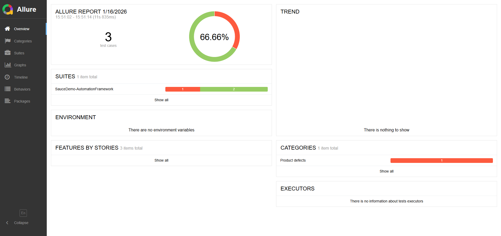
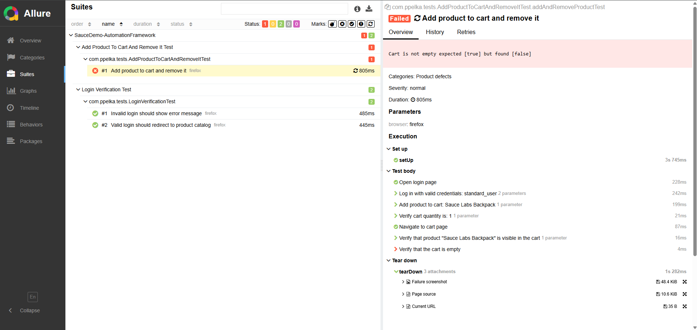
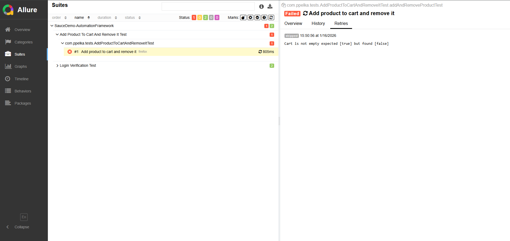

## 🧪 SauceDemo Automation Framework

UI test automation framework for SauceDemo built with Selenium WebDriver, TestNG, Allure, and the Page Object Model.Designed for clean architecture, rich reporting, and CI/CD integration.


## 🚀 Technologies Used

Java 17

Selenium WebDriver

TestNG

Allure Reporting

Maven

GitHub Actions (CI/CD)

Page Object Model (POM)

Retry Analyzer + Listener

Custom Config Reader

## 🧱 Project Structure

- src/
    - main/
        - java/com.ppelka/
            - abstractcomponents/
            - core/
            - pageobjects/
    - test/
        - java/com.ppelka/
            - steps/
            - testbase/
            - tests/
        - resources/
            - config.properties
            - allure.properties
            - testng.xml

## 🧬 Architecture Diagram

```mermaid
flowchart TB
  A[TestNG suite<br/>testng.xml] --> B[Test Classes<br/>(Checkout, Cart, Login)]
  B --> C[Steps Layer<br/>(business actions, @Step)]
  C --> D[Page Objects<br/>(locators, interactions)]
  D --> E[AbstractComponent<br/>(explicit waits, helpers)]
  E --> F[Core Utilities<br/>DriverManager, WebDriverFactory, ConfigReader]
  F --> G[Selenium WebDriver]
  G --> H[Allure Reports<br/>(steps, screenshots, retry history)]
  H --> I[CI/CD Pipeline<br/>(GitHub Actions)]
```

## 🧪 How to Run Tests

1. Install dependencies

mvn clean install

2. Run tests

mvn test

3. Generate Allure Report

allure serve target/allure-results

## 📊 Allure Reporting

Each test step is annotated with @Step

Automatic screenshot capture on failure

Attachments for logs and diagnostics

Results stored in target/allure-results

## 📊 Sample Allure Report

Below are example screenshots generated from the framework to illustrate how Allure presents test execution, failures, and retry attempts.

### Overview


### Failed Test Details


### Retry History



## 🔁 Retry Logic

The framework includes a custom RetryAnalyzer that automatically re‑runs a test once if the initial execution fails.

The retry mechanism is fully integrated with TestNG listeners

Allure records every test attempt, including retries

The report clearly shows:

which attempt passed or failed

full diagnostics for each attempt (screenshot, page source, console logs)

a complete execution timeline for debugging

This approach provides visibility into potentially flaky scenarios and demonstrates how the framework handles failures, captures detailed diagnostics, and presents retry history in Allure.

The Allure report included in this project contains an example test that illustrates how retry attempts are displayed and how failure details are captured.

## ⚙️ Configuration

All configuration is stored in: src/test/resources/config.properties

Loaded via ConfigReader class.

## 🧪 Sample Test Scenarios

✔ Valid login

❌ Invalid login

🛒 Add product to cart

🧹 Remove product from cart

🔍 Verify product catalog

🔄 Multi-step product flow (coming soon)

## 📦 CI/CD Integration (coming soon)

Planned GitHub Actions workflow:

Build project

Run tests

Generate Allure results

Upload report as artifact

Add build & test badges to README

## 💡 Why This Project Matters

This framework demonstrates:

Clean automation architecture

Real-world testing patterns

Reporting and diagnostics

CI/CD readiness

Portfolio-quality engineering

## 📌 Future Improvements

[ ] Add more test scenarios

[ ] Add Docker Selenium Grid

[ ] Add environment switching

[ ] Add badges

[ ] Add architecture diagram

## 📜 License

This project is licensed under the MIT License.
