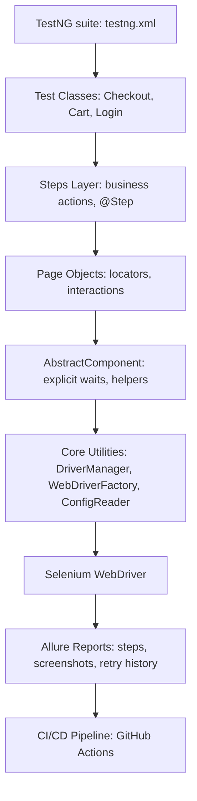

## 🧪 SauceDemo Automation Framework

## ⚡ TL;DR – Why this project matters

- Clean, layered architecture (Steps → Page Objects → AbstractComponent → Core Utilities)
- Fluent, scenario‑focused test layer with zero Page Objects in test classes
- Allure + AspectJ weaving for automatic step logging, screenshots, and retry history
- CI/CD pipeline on GitHub Actions with Allure results uploaded on every push/PR
- Configurable, environment‑agnostic WebDriver lifecycle (DriverManager + WebDriverFactory)
- Fully modular structure: steps, listeners, utils, testbase, tests, pageobjects
- Retry logic with full diagnostics and attempt history in Allure

UI test automation framework for SauceDemo built with Selenium WebDriver, TestNG, Allure, and the Page Object Model. Designed for clean architecture, rich reporting, and CI/CD integration.


🔗 Application under test: https://www.saucedemo.com/

## 🚀 Technologies Used

Java 17

Selenium WebDriver

TestNG

Allure Reporting

Maven

GitHub Actions (CI/CD)

Page Object Model (POM)

Retry Analyzer + Listener

Custom Config Reader

## 🧱 Project Structure

- src/
    - main/
        - java/com.ppelka/
            - abstractcomponents/
            - core/
            - pageobjects/
    - test/
        - java/com.ppelka/
            - data/
            - listeners/
            - steps/
            - testbase/
            - tests/
            - utils/
        - resources/
            - config.properties
            - allure.properties

## 🧬 Architecture Diagram



## 🔑 Key Features

### ✔ Layered test architecture
- Clear separation of responsibilities:
- TestNG suite
- Test classes
- Steps (business layer)
- Page Objects
- AbstractComponent
- Core utilities
- WebDriver
- Allure
- CI/CD

### ✔ Steps layer (business‑level API)
All tests use fluent Steps instead of Page Objects.
This makes scenarios readable and stable:

```java
loginSteps.openLoginPage()
          .loginValid("standard_user", "secret_sauce");

productSteps.addProduct("Sauce Labs Backpack")
            .verifyCartQuantity("1")
            .goToCart();
```
### ✔ Page Object Model with shared UI abstractions
Common waits and helpers live in AbstractComponent.

### ✔ Robust WebDriver lifecycle
DriverManager + WebDriverFactory ensure clean setup and teardown.

### ✔ Allure reporting with automatic step logging
AspectJ weaves all @Step methods into Allure reports.

### ✔ Retry logic with full diagnostics
Failed tests are automatically retried once.

Allure shows retry history with screenshots.

### ✔ Flexible configuration
ConfigReader merges system properties with config.properties.

### ✔ CI/CD ready
GitHub Actions workflow runs tests on every push/PR.

## 🔄 How It Works (Test Flow)

This framework follows a clean, layered execution flow that keeps tests readable, maintainable, and easy to debug.  
A single test run moves through the following stages:

1. **TestNG Suite (`testng.xml`)**

   The entry point that defines which tests to run and provides suite‑level configuration.

2. **BaseTest**
   
   Initializes WebDriver, Page Objects, and all Steps.  
   Tests never instantiate Steps manually.

3. **Test Class**
   
   Contains only the scenario flow and delegates all actions to the Steps layer.

4. **Steps Layer (@Step methods)**  
  
   Expresses business logic in a human‑readable way.  
   All methods are annotated with `@Step`, and AspectJ automatically logs them into Allure.

5. **Page Objects**  

   Encapsulate UI structure and interactions for each page.  
   They delegate shared behavior to `AbstractComponent`.

6. **AbstractComponent**  

   Provides reusable UI helpers such as explicit waits, element lookup, and synchronization.  
   Ensures stable and consistent interactions across all Page Objects.

7. **Core Utilities**

    - `DriverManager` manages WebDriver lifecycle
    - `WebDriverFactory` configures browser instances
    - `ConfigReader` resolves environment settings  

   These utilities ensure stable, environment‑agnostic execution.

8. **Selenium WebDriver**  

   Executes browser actions triggered by Page Objects and Steps.

9. **Allure Reporting**  

   Captures step‑level logs, screenshots, retry attempts, and execution metadata.  
   Allure results are stored in `target/allure-results`.

10. **CI/CD Pipeline (GitHub Actions)**  
   On every push/PR, the pipeline runs the full suite, caches dependencies, and uploads Allure results as artifacts.

This flow keeps responsibilities clearly separated and ensures that each test is easy to understand, debug, and extend.

## 🧪 How to Run Tests

1. **Install dependencies**
```bash
mvn clean install
```
2. **Run the full TestNG suite**
```bash
mvn test
```
3. **Run specific TestNG groups**
- Smoke tests
```bash
mvn test -Dgroups="smoke"
```
- Regression tests
```bash
mvn test -Dgroups="regression"
```
- Multiple groups
```bash
mvn test -Dgroups="smoke,regression"
```

4. **Generate the Allure report locally**
```bash
allure serve target/allure-results
```
### Additional notes

- **Retry logic**  
  Failed tests are automatically re‑run once using a custom `RetryAnalyzer`.  
  Allure records each attempt separately, making flaky behavior easy to diagnose.

- **Allure step logging (AspectJ weaver)**  
  The framework uses the AspectJ Java agent (configured in the Surefire plugin) to intercept `@Step` methods.  
  This enables automatic step‑level reporting without writing manual logging code.

## 📊 Allure Reporting

Allure provides rich, visual reporting for every test execution.  
This framework integrates Allure with TestNG using AspectJ weaving, which automatically captures:

- step‑level execution (`@Step` methods)
- screenshots on failure
- retry attempts and their history
- attachments and metadata
- execution timeline and environment details

### How it works

The Surefire plugin runs the JVM with the AspectJ Java agent:

- All methods annotated with `@Step` are intercepted at runtime
- Each intercepted call is logged as a step in the Allure report
- Failures trigger automatic screenshot capture
- Retry attempts are grouped and displayed clearly in the UI

Allure results are stored in:
`target/allure-results`

You can generate a local report using:
```bash
allure serve target/allure-results
```
## 📊 Sample Allure Report

Below are example screenshots generated from the framework to illustrate how Allure presents test execution, failures, and retry attempts.

### Overview


### Failed Test Details


### Retry History


## 🔁 Retry Logic

The framework includes a custom `RetryAnalyzer` that automatically re‑runs a test once if the initial execution fails.

The retry mechanism is fully integrated with TestNG listeners.

Allure records every test attempt, including retries.

The report clearly shows:
- which attempt passed or failed
- full diagnostics for each attempt (screenshot, page source, console logs)
- a complete execution timeline for debugging

This approach provides visibility into potentially flaky scenarios and demonstrates how the framework handles failures, captures detailed diagnostics, and presents retry history in Allure.

The Allure report included in this project contains an example test that illustrates how retry attempts are displayed and how failure details are captured.

## ⚙️ Configuration

All configuration is stored in: `src/test/resources/config.properties`

Loaded via `ConfigReader` class.

## 🧪 Sample Test Scenarios

🔐 **Login verification (data‑driven)**  
A parameterized TestNG test that validates the login process using multiple input datasets.  
This approach demonstrates data‑driven testing rather than separate “valid/invalid login” test cases.

🛒 **Add product to cart & remove it**  
Covers the full cart interaction flow: adding an item, verifying cart contents, and removing the product.

💳 **Complete checkout flow (end‑to‑end)**  
Simulates a full purchase journey: login → add product → cart review → checkout information → order overview → order completion.

## 📦 CI/CD Integration (GitHub Actions)

This project includes a fully configured CI pipeline using GitHub Actions.  
The workflow runs automatically on every push and pull request to the `main` branch.

### What the pipeline does

- **Checks out the repository**
- **Sets up JDK 17** using Temurin distribution
- **Caches Maven dependencies** for faster builds
- **Runs the full TestNG suite** via `mvn clean test`
- **Collects Allure results** generated during the run
- **Uploads `allure-results` as a downloadable artifact**
- **Provides a build status badge** visible at the top of this README

### Why it matters

- Ensures consistent, repeatable test execution across environments
- Makes test results available directly from the CI pipeline
- Enables future enhancements such as:
    - publishing Allure reports automatically
    - running tests in parallel
    - integrating with Selenium Grid or Docker
    - triggering nightly regression runs

The workflow file is located at:
`.github/workflows/maven-tests.yml`

## 🧠 Why This Framework Is Senior‑Level

This framework reflects engineering practices aligned with senior-level test automation. It goes beyond basic Selenium usage and demonstrates architectural thinking, maintainability, and CI/CD readiness.

### ✅ Clean layered architecture
Each layer has a clear responsibility:
- **Test Classes** define scenarios
- **Steps Layer** expresses business actions with `@Step` annotations
- **Page Objects** encapsulate UI structure and behavior
- **AbstractComponent** centralizes waits and helpers
- **Core Utilities** manage drivers, config, and environment

This separation ensures scalability, readability, and ease of debugging.

### ✅ Robust WebDriver lifecycle
The framework uses `DriverManager` and `WebDriverFactory` to control browser setup, teardown, and configuration. This prevents flaky tests and supports headless execution, parallel runs, and environment switching.

### ✅ Diagnostic reporting with Allure + AspectJ
Allure is fully integrated via AspectJ weaving, enabling automatic step-level logging, screenshots on failure, retry history, and rich visual summaries. This level of observability is critical for debugging and stakeholder communication.

### ✅ Retry logic with full traceability
A custom `RetryAnalyzer` and TestNG listener re-run failed tests once. Allure captures each attempt separately, including screenshots and logs, making flaky behavior easy to detect and analyze.

### ✅ CI/CD integration
The GitHub Actions workflow runs tests on every push/PR, caches dependencies, and uploads Allure results as artifacts. This ensures fast feedback and prepares the project for future automation like report publishing or grid execution.

### ✅ Defensive programming and explicit waits
The framework avoids brittle locators and race conditions by using explicit waits, visibility checks, and helper methods. This improves test reliability and reduces false negatives.

### ✅ Configuration abstraction
The `ConfigReader` supports layered config resolution (system properties → config file → defaults), enabling flexible control over browser type, base URL, and execution mode.

### ✅ Portfolio-quality engineering
The project is documented, modular, and visually polished. It includes architecture diagrams, sample reports, and a build badge — all designed to showcase professional automation skills to recruiters and teams.

### ✅ Fluent, scenario‑focused test layer
All tests use a fluent Steps API, making scenarios expressive and eliminating direct Page Object usage in test classes.


## 📌 Future Improvements

[ ] Add Docker Selenium Grid

[ ] Add environment switching

## 📜 License

This project is licensed under the MIT License.