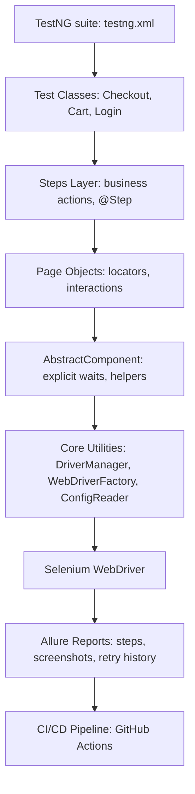

## 🧪 SauceDemo Automation Framework

UI test automation framework for SauceDemo built with Selenium WebDriver, TestNG, Allure, and the Page Object Model.Designed for clean architecture, rich reporting, and CI/CD integration.

## 🚀 Technologies Used

Java 17

Selenium WebDriver

TestNG

Allure Reporting

Maven

GitHub Actions (CI/CD)

Page Object Model (POM)

Retry Analyzer + Listener

Custom Config Reader

## 🧱 Project Structure

- src/
    - main/
        - java/com.ppelka/
            - abstractcomponents/
            - core/
            - pageobjects/
    - test/
        - java/com.ppelka/
            - steps/
            - testbase/
            - tests/
        - resources/
            - config.properties
            - allure.properties
            - testng.xml

## 🧬 Architecture Diagram

## 🔑 Key Features

- **Layered test architecture**  
  A clean separation of responsibilities across TestNG suite → Test Classes → Steps (business layer) → Page Objects → AbstractComponent → Core Utilities → Selenium WebDriver → Allure → CI/CD. This structure keeps the framework maintainable, scalable, and easy to extend.

- **Page Object Model with shared UI abstractions**  
  Each page is represented by a dedicated Page Object, while common UI logic (explicit waits, interaction helpers, synchronization) is centralized in `AbstractComponent`. This eliminates duplication and ensures consistent behavior across the entire test suite.

- **Robust WebDriver lifecycle management**  
  `DriverManager` and `WebDriverFactory` handle browser creation, configuration, cleanup, and environment‑specific settings. This improves test stability and makes switching browsers or enabling headless mode effortless.

- **Rich Allure reporting**  
  Full integration with Allure (TestNG + AspectJ) provides step‑level reporting, screenshots on failure, retry history, attachments, and clean visual summaries. Reports are highly readable and ideal for debugging and stakeholder visibility.

- **Automatic retry logic with full diagnostics**  
  A custom `RetryAnalyzer` and TestNG listener automatically re‑run failed tests once. Allure records each attempt separately, including screenshots and logs, making flaky tests easy to identify and analyze.

- **Flexible configuration system**  
  `ConfigReader` merges system properties with `config.properties`, allowing dynamic control over browser type, headless mode, base URL, and other settings without modifying code. Perfect for multi‑environment execution.

- **CI/CD ready (GitHub Actions)**  
  A dedicated workflow runs tests on every push/PR, caches Maven dependencies, and uploads Allure results as artifacts. The project is prepared for further automation such as publishing reports or running tests in parallel.

- **Readable, scenario‑focused tests**  
  The Steps layer expresses business actions in a human‑friendly way, making tests easy to understand during reviews and suitable for collaboration with non‑technical stakeholders.

## 🧪 How to Run Tests

1. Install dependencies

mvn clean install

2. Run tests

mvn test

3. Generate Allure Report

allure serve target/allure-results

## 📊 Allure Reporting

Each test step is annotated with @Step

Automatic screenshot capture on failure

Attachments for logs and diagnostics

Results stored in target/allure-results

## 📊 Sample Allure Report

Below are example screenshots generated from the framework to illustrate how Allure presents test execution, failures, and retry attempts.

### Overview

### Failed Test Details

### Retry History

## 🔁 Retry Logic

The framework includes a custom `RetryAnalyzer` that automatically re‑runs a test once if the initial execution fails.

The retry mechanism is fully integrated with TestNG listeners

Allure records every test attempt, including retries

The report clearly shows:

which attempt passed or failed

full diagnostics for each attempt (screenshot, page source, console logs)

a complete execution timeline for debugging

This approach provides visibility into potentially flaky scenarios and demonstrates how the framework handles failures, captures detailed diagnostics, and presents retry history in Allure.

The Allure report included in this project contains an example test that illustrates how retry attempts are displayed and how failure details are captured.

## ⚙️ Configuration

All configuration is stored in: `src/test/resources/config.properties`

Loaded via `ConfigReader` class.

## 🧪 Sample Test Scenarios

🔐 **Login verification (data‑driven)**  
A parameterized TestNG test that validates the login process using multiple input datasets.  
This approach demonstrates data‑driven testing rather than separate “valid/invalid login” test cases.

🛒 **Add product to cart & remove it**  
Covers the full cart interaction flow: adding an item, verifying cart contents, and removing the product.

💳 **Complete checkout flow (end‑to‑end)**  
Simulates a full purchase journey: login → add product → cart review → checkout information → order overview → order completion.

## 📦 CI/CD Integration (GitHub Actions)

This project includes a fully configured CI pipeline using GitHub Actions.  
The workflow runs automatically on every push and pull request to the `main` branch.

### What the pipeline does

- **Checks out the repository**
- **Sets up JDK 17** using Temurin distribution
- **Caches Maven dependencies** for faster builds
- **Runs the full TestNG suite** via `mvn clean test`
- **Collects Allure results** generated during the run
- **Uploads `allure-results` as a downloadable artifact**
- **Provides a build status badge** visible at the top of this README

### Why it matters

- Ensures consistent, repeatable test execution across environments
- Makes test results available directly from the CI pipeline
- Enables future enhancements such as:
    - publishing Allure reports automatically
    - running tests in parallel
    - integrating with Selenium Grid or Docker
    - triggering nightly regression runs

The workflow file is located at:
`.github/workflows/maven-tests.yml`

## 🧠 Why This Framework Is Senior‑Level

This framework reflects engineering practices aligned with senior-level test automation. It goes beyond basic Selenium usage and demonstrates architectural thinking, maintainability, and CI/CD readiness.

### ✅ Clean layered architecture
Each layer has a clear responsibility:
- **Test Classes** define scenarios
- **Steps Layer** expresses business actions with `@Step` annotations
- **Page Objects** encapsulate UI structure and behavior
- **AbstractComponent** centralizes waits and helpers
- **Core Utilities** manage drivers, config, and environment

This separation ensures scalability, readability, and ease of debugging.

### ✅ Robust WebDriver lifecycle
The framework uses `DriverManager` and `WebDriverFactory` to control browser setup, teardown, and configuration. This prevents flaky tests and supports headless execution, parallel runs, and environment switching.

### ✅ Diagnostic reporting with Allure + AspectJ
Allure is fully integrated via AspectJ weaving, enabling automatic step-level logging, screenshots on failure, retry history, and rich visual summaries. This level of observability is critical for debugging and stakeholder communication.

### ✅ Retry logic with full traceability
A custom `RetryAnalyzer` and TestNG listener re-run failed tests once. Allure captures each attempt separately, including screenshots and logs, making flaky behavior easy to detect and analyze.

### ✅ CI/CD integration
The GitHub Actions workflow runs tests on every push/PR, caches dependencies, and uploads Allure results as artifacts. This ensures fast feedback and prepares the project for future automation like report publishing or grid execution.

### ✅ Defensive programming and explicit waits
The framework avoids brittle locators and race conditions by using explicit waits, visibility checks, and helper methods. This improves test reliability and reduces false negatives.

### ✅ Configuration abstraction
The `ConfigReader` supports layered config resolution (system properties → config file → defaults), enabling flexible control over browser type, base URL, and execution mode.

### ✅ Portfolio-quality engineering
The project is documented, modular, and visually polished. It includes architecture diagrams, sample reports, and a build badge — all designed to showcase professional automation skills to recruiters and teams.

## 📌 Future Improvements

[ ] Add Docker Selenium Grid

[ ] Add environment switching

## 📜 License

This project is licensed under the MIT License.
